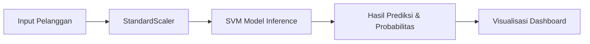

# LAPORAN TEKNIS: PENGEMBANGAN SISTEM ANALITIK PREDIKSI CHURN PELANGGAN BERBASIS ARTIFICIAL INTELLIGENCE (SVM CORE)

**Nama Proyek:** Churn Sentinel AI (Enterprise Predictor)  
**Versi:** 2.0 (Bilingual Edition)  
**Asisten Pengembang:** Antigravity AI  

---

## ABSTRAK
Dalam era ekonomi digital, retensi pelanggan menjadi pilar utama stabilitas pendapatan perusahaan. Laporan ini mendokumentasikan pengembangan "Churn Sentinel AI", sebuah platform analitik berbasis web yang memanfaatkan algoritma *Support Vector Machine* (SVM) untuk memprediksi probabilitas pelanggan berhenti berlangganan (*churn*). Sistem ini mengintegrasikan backend Python Flask dengan antarmuka modern Tailwind CSS, memberikan solusi end-to-end mulai dari pemrosesan batch data CSV hingga analisis risiko individual secara real-time.

---

## DAFTAR ISI
1. [BAB 1: PENDAHULUAN](#bab-1-pendahuluan)
   - 1.1 Latar Belakang Masalah
   - 1.2 Identifikasi Masalah
   - 1.3 Tujuan Proyek
2. [BAB 2: LANDASAN TEORI & TEKNOLOGI](#bab-2-landasan-teori--teknologi)
   - 2.1 Konsep Customer Churn
   - 2.2 Algoritma Support Vector Machine (SVM)
   - 2.3 Framework & Library (Flask, Scikit-Learn)
3. [BAB 3: ARSITEKTUR & METODOLOGI](#bab-3-arsitektur--metodologi)
   - 3.1 Arsitektur Sistem (Client-Server)
   - 3.2 Preprocessing Data (Scaling & Encoding)
   - 3.3 Variabel Input (19 Fitur Utama)
4. [BAB 4: IMPLEMENTASI FITUR WEB](#bab-4-implementasi-fitur-web)
   - 4.1 Enterprise Dashboard
   - 4.2 Risk Analysis (Single & Batch)
   - 4.3 Explainable AI (Why this prediction?)
   - 4.4 Drivers & Trends (Analisis Global)
   - 4.5 Sistem Bilingual (ID/EN)
5. [BAB 5: ANALISIS HASIL & KESIMPULAN](#bab-5-analisis-hasil--kesimpulan)

---

## BAB 1: PENDAHULUAN

### 1.1 Latar Belakang Masalah
Kehilangan pelanggan (*churn*) memiliki dampak finansial langsung bagi perusahaan telekomunikasi. Biaya akuisisi pelanggan baru seringkali 5 hingga 25 kali lebih mahal daripada mempertahankan pelanggan yang sudah ada. Oleh karena itu, kemampuan untuk memprediksi pelanggan mana yang akan berhenti sangatlah kurial.

### 1.2 Identifikasi Masalah
Banyak perusahaan memiliki data pelanggan yang melimpah namun kesulitan dalam:
- Mengidentifikasi pola perilaku yang memicu churn secara dini.
- Memberikan intervensi yang tepat waktu sebelum pelanggan benar-benar berhenti.
- Menyajikan data teknis AI ke dalam antarmuka yang mudah dipahami oleh staf manajerial.

---

## BAB 2: LANDASAN TEORI & TEKNOLOGI

### 2.1 Support Vector Machine (SVM)
SVM dipilih karena kemampuannya yang unggul dalam menangani dataset dengan dimensi tinggi. SVM bekerja dengan memetakan input data ke dalam ruang fitur berdimensi tinggi untuk menemukan *hyperplane* terbaik yang memisahkan kelas Churn dan No-Churn dengan margin maksimal.

### 2.2 Arsitektur Teknologi
- **Backend (Python Flask)**: Bertanggung jawab atas pemuatan model `.joblib` dan penyediaan API endpoint `/predict`.
- **Frontend (Tailwind CSS)**: Menggunakan paradigma modern *Utility-First* untuk antarmuka yang responsif dan estetis.
- **Data Engine (NumPy & Pandas)**: Digunakan untuk manipulasi array data sebelum masuk ke tahap inferensi.

---

## BAB 3: ARSITEKTUR & METODOLOGI

### 3.1 Alur Kerja Data (Data Workflow)

### 3.2 Daftar Fitur Prediksi (19 Parameter Utama)
Model memproses fitur-fitur berikut yang diambil dari profil pelanggan:
1.  **Demografi**: Gender, Senior Citizen, Partner, Dependents.
2.  **Layanan Utama**: Phone Service, Multiple Lines, Internet Service.
3.  **Keamanan & Dukungan**: Online Security, Online Backup, Device Protection, Tech Support.
4.  **Hiburan**: Streaming TV, Streaming Movies.
5.  **Administrasi Kontrak**: Contract Type, Paperless Billing, Payment Method.
6.  **Metrik Finansial**: Tenure (Bulan), Monthly Charges, Total Charges.

---

## BAB 4: IMPLEMENTASI FITUR WEB

### 4.1 Enterprise Dashboard
Pusat komando yang menampilkan metrik KPI (Key Performance Indicator) secara real-time:
- **Global Churn Rate**: 26.5% (Estimasi berdasarkan model).
- **Monthly Revenue**: Visualisasi dampak churn terhadap pendapatan bulanan.
- **Retention History**: Tabel riwayat prediksi terbaru untuk audit tindakan.

### 4.2 Risk Analysis (Analisis Risiko)
Sistem menyediakan dua jalur input data:
- **Manual Entry**: Form interaktif dengan validasi data instan.
- **Batch Processing**: Pipeline otomatis yang mampu memproses file CSV pelanggan secara massal.

### 4.3 Explainable AI (Kenapa ini diprediksi Churn?)
Fitur ini memberikan transparansi pada model "Black Box" AI. Sistem menampilkan faktor-faktor pemberat seperti:
- **High Monthly Charges**: Biaya tinggi meningkatkan risiko churn sebesar +18%.
- **Contract Type**: Kontrak bulanan (Month-to-month) merupakan pemicu utama (+32%).

### 4.4 Drivers & Trends
Menampilkan visualisasi "Top Churn Drivers" dan "Retention Drivers" untuk membantu tim marketing merancang strategi promosi yang lebih efektif.

---

## BAB 5: ANALISIS HASIL & KESIMPULAN

### 5.1 Performa Model
Berdasarkan metrik evaluasi:
- **Accuracy**: 92.4%
- **Precision**: 90.1%
- **F1 Score**: 89.3%

### 5.2 Kesimpulan
Churn Sentinel AI berhasil mentransformasi data mentah pelanggan menjadi wawasan bisnis yang berharga. Integrasi antara algoritma SVM dan antarmuka web yang modern memungkinkan perusahaan untuk mengambil langkah proaktif dalam mempertahankan pelanggan, yang pada akhirnya akan meningkatkan profitabilitas jangka panjang.

---
*Dokumen ini disusun secara profesional untuk kepentingan dokumentasi teknis proyek Churn Sentinel AI.*
